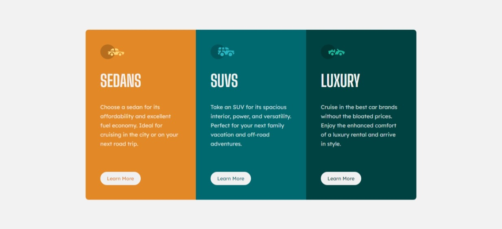

# Frontend Mentor - 3-column preview card component solution

This is a solution to the [3-column preview card component challenge on Frontend Mentor](https://www.frontendmentor.io/challenges/3column-preview-card-component-pH92eAR2-). Frontend Mentor challenges help you improve your coding skills by building realistic projects. 

## Table of contents

- [Overview](#overview)
  - [The challenge](#the-challenge)
  - [Screenshot](#screenshot)
  - [Links](#links)
- [My process](#my-process)
  - [Built with](#built-with)
  - [What I learned](#what-i-learned)
  - [Continued development](#continued-development)
  - [Useful resources](#useful-resources)
- [Author](#author)

## Overview

### The challenge

Users should be able to:

- View the optimal layout depending on their device's screen size
- See hover states for interactive elements

### Screenshot

### Links

- Solution URL: [Solution URL here](https://www.frontendmentor.io/solutions/3column-preview-card-component-using-flexbox-yeVnTeGyp8)
- Live Site URL: [Live site URL here](https://i-strider243.github.io/3-column-preview-card-component/)

## My process

### Built with

- Semantic HTML5 markup
- CSS custom properties
- Flexbox
- Mobile-first workflow
- Google Fonts

### What I learned

Display Flex requires enough components and elements to be really active.

### Continued development

I will continue to learn more on CSS Specificity as I came across a slight issue when adding color on hover state to the button element.

### Useful resources

- [Google Fonts](https://fonts.google.com/?query=big+sh) - This helped me with the needed fonts for styling this card component. I really liked the fonts and will use it going forward.

## Author

- Github - [i-strider243](https://github.com/i-Strider243)
- Frontend Mentor - [@i-Strider243](https://www.frontendmentor.io/profile/i-Strider243)
- Twitter - [@Strider18](https://twitter.com/Strider18)
